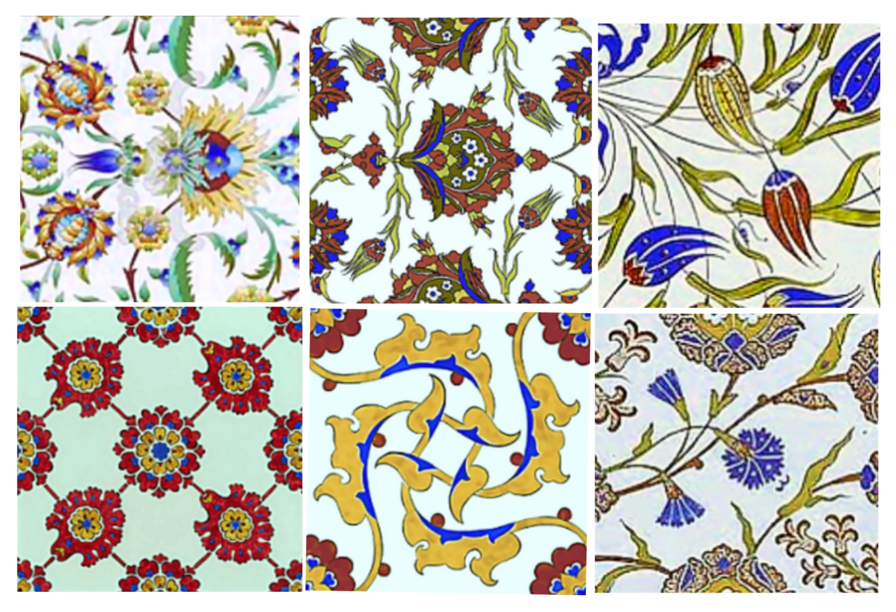

**Automated Artwork Image Restoration Using CNNs: A Deep Learning
Approach to Image Inpainting for Pottery**

**Project Overview**

Artworks and historical artifacts are often subjected to damage due to
environmental conditions, accidents, or vandalism. Traditional methods
of restoration are not only time-consuming but also require skilled
artisans.

This project aims to addresses the challenge of image inpainting,
specifically focusing on the restoration of damaged pottery images by
removing multicolor lines and reconstructing them to their original,
undamaged state. Utilizing deep learning techniques, particularly
Convolutional Neural Networks (CNNs), this project demonstrates to
automate the restoration process, making it more efficient and scalable.
The restoration is performed using a Convolutional Neural Network (CNN)
model based on the U-Net architecture.

**Task:**

Image inpainting task: Building a model based on the U-Net architecture,
a type of CNN designed consisting of an encoder-decoder structure that
captures high-resolution details and multi-scale features, making it
suitable for inpainting tasks.

**Datasets**

## The dataset consists of 660 Kubachi ware images also known as Persian pottery which is prominently featured in Iranian historical artwork to decorate houses, mosques, palaces, tombs and historical or architectural structures. This genre of art primarily consists of flat pieces like bowls, plates, and ceramics, embellished with an array of decorative motifs and patterns in hues like black, green, blue, ochre, brown etc. 

The dataset is publicly accessible at
<https://github.com/NacerFaraj/Persian-Pottery-Dataset>

## 

Figure 1: Pottery images from the dataset.

**Preprocessing**

## Prior to training, the images undergo several preprocessing steps:

## Loading and Resizing: Images are loaded and resized to a consistent size of 256x256 pixels.

## Normalization: Pixel values are normalized to the range \[0, 1\].

## Data Augmentation: Techniques such as random rotations, flips, and brightness adjustments are applied to increase data diversity and enhance model robustness.

## Masking: Random multicolor lines are added to simulate damage, creating a set of masked images for training.

## CNN Architecture

Experiments were conducted with the UNet architecture which included
masking with single and multiple random colours, as well as with and
without augmentation. The final model’s architecture comprised masking
with numerous colours and an augmentation technique involves the below
components.

**Input layer**: The model accepts input images of dimensions (256, 256,
3), corresponding to images with a height and width of 256 pixels and
three colour channels.

**Encoder layer**: The Unet’s encoder part captures context by gradually
reducing spatial dimension and increasing depth. It consists of 4
convolutional blocks each with 2 convolutional layers (Conv2D) followed
by a max-pooling layer (MaxPooling2D). The filters in each block
progressively increase from 32, 64, 128, 256. While the image is
downsampled from 256x256 to 128x128, 64x64, and 32x32 pixels.

**Bottleneck**: The bottleneck is the deepest layer that integrates the
encoder and decoder modules of the Unet network. It involves 2
convolutional layers (Conv2D) with most 512 filters.

**Decoder layer**: The decoder rebuilds the image by gradually
increasing the spatial dimension and reducing the feature maps utilising
skip connections and the corresponding encoder information. Its 4
convolutional blocks start with a transpose convolutional layer
(Conv2DTranspose), a concatenate layer (Concatenate), followed by 2
convolutional layers (Conv2D). The filters in the blocks gradually
decrease from 256, 128, 64, and 32, whereas the image dimension
upsamples from 32x32 to 64x64, 128x128, and 256x256 pixels.

**Output layer**: This is the final convolutional layer that uses the
sigmoid activation function to generate inpainted image of 256x256 size
and 3 colour channels.

## Model Summary

Below are the details of the Unet model settings utilised to train and
evaluate the model performance for inpainting task.

<table>
<colgroup>
<col style="width: 33%" />
<col style="width: 66%" />
</colgroup>
<thead>
<tr>
<th style="text-align: left;"><strong>Settings</strong></th>
<th style="text-align: left;"><strong>Unet CNN Model</strong></th>
</tr>
</thead>
<tbody>
<tr>
<td style="text-align: left;">Input Image Size</td>
<td style="text-align: left;">256x256</td>
</tr>
<tr>
<td style="text-align: left;">Convolutional layers</td>
<td style="text-align: left;">
Encoder: 4 units each with 2
convolutional layers

Bottleneck: 2 convolutional layers

Decoder: 4 units each with 1 transposed convolutional layers and 2
convolutional layers
</td>
</tr>
<tr>
<td style="text-align: left;">Activation Function</td>
<td style="text-align: left;">sigmoid</td>
</tr>
<tr>
<td style="text-align: left;">Optimiser</td>
<td style="text-align: left;">Adam</td>
</tr>
<tr>
<td style="text-align: left;">Loss</td>
<td style="text-align: left;">mean_absolute_error</td>
</tr>
<tr>
<td style="text-align: left;">Metric</td>
<td style="text-align: left;">dice_coef</td>
</tr>
<tr>
<td style="text-align: left;">Epochs</td>
<td style="text-align: left;">300</td>
</tr>
<tr>
<td style="text-align: left;">Trainable Parameters</td>
<td style="text-align: left;">7,760,931</td>
</tr>
<tr>
<td style="text-align: left;">Non-trainable Parameters</td>
<td style="text-align: left;">0</td>
</tr>
</tbody>
</table>

Experimental results:

Above are the performance results of the UNet CNN model trained
specifically to remove the artificially inserted multicolor lines.

<table>
<colgroup>
<col style="width: 45%" />
<col style="width: 54%" />
</colgroup>
<thead>
<tr>
<th style="text-align: left;"><strong>Performance score</strong></th>
<th style="text-align: left;"><strong>Unet Model</strong></th>
</tr>
</thead>
<tbody>
<tr>
<td style="text-align: left;">Loss</td>
<td style="text-align: left;">
Training: 0.0159

Validation: 0.0180
</td>
</tr>
<tr>
<td style="text-align: left;">Dice coefficient</td>
<td style="text-align: left;">
Training: 72.09%

Validation: 74.18%
</td>
</tr>
</tbody>
</table>

Mean Absolute Error (MAE) is used to assess the average magnitude of
errors between predicted and actual pixel values of the images. The low
MAE value of 0.0159 for the training and 0.0180 for the validation
indicates the model's better performance. Dice Coefficient measures the

The Dice Coefficient assesses the intersecting between the ground truth
and the projected inpainted region. Higher values of the metric denote
the better performance. With a Dice Coefficient of 72% on the training
and 74% on the validation, the model shows good overlap and accurate
inpainting.

Below is the testing evidence.

Figure 7: Inference results

Figure 8: Inference results

Figure 9: Inference results

The UNet model's output on unseen pottery photos is shown in the figure
7, 8 and 9. Each set involves the distorted testing image with
multicolor lines and the corresponding inpainted image post the
inpainting by the model.

The testing image depicts a design of pottery with several artificially
added multicoloured lines that obscure the intricacies and detracts the
aesthetic appeal of the original image. Whereas, it can be observed, the
multicoloured lines have been successfully removed in the inpainted
image while retaining the intricate patterns, visual coherence and
consistency of the pottery's image.

**Conclusion**

The project focuses on an inpainting task utilizing the CNN network that
reconstructs the damaged image by removing colourful lines drawn on it.
The Unet CNN architecture achieved this goal through the encoder and
decoder module captured the context of the image and learned effectively
to reconstruct the damaged part of the image.

Overall, the project showed how to use Unet CNN for inpainting tasks and
has been able to give effective results in reconstructing damaged
images.

Going forward I would like to gather naturally distorted images and
their undistorted versions by exploring local galleries, and historical
sites and incorporate them into our inpainting process to discover if
CNN models could accurately reconstruct the naturally damaged to its
undamaged state.

**Prerequisites**

-   Python 3.7+

-   TensorFlow 2.x

-   Keras

-   NumPy

-   OpenCV

-   Matplotlib

-   Wagtail (for web application)

-   Jupyter Notebook

**Repository Structure**

|-- notebooks

| |-- DeepLearning\_Image\_Inpainting\_CNN.ipynb

|-- report

| |-- Project Report.pdf

|-- dataset

| |-- Persian Pottery Images

|-- web\_app

| |-- Artwork\_Inpainting

| |-- mysite

|-- requirements.txt

|-- README.md

